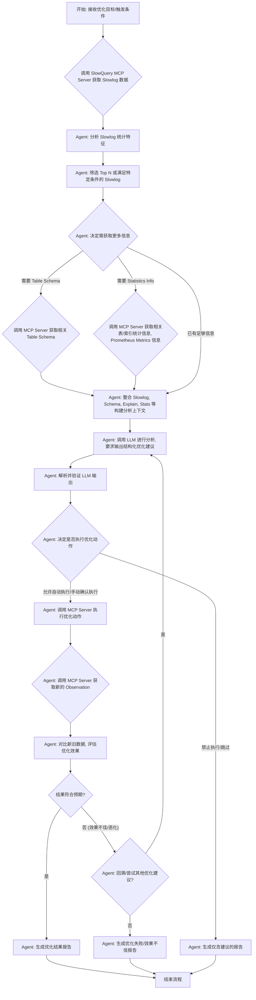

# Background

随着业务的快速发展，部署的 TiDB 集群规模持续扩大，承载的应用也日益复杂。这导致了慢 SQL 查询（Slow SQL Queries）的数量和复杂度显著增加。这些慢查询不仅直接影响线上应用的性能和用户体验，降低数据库整体稳定性，还给数据库管理员（DBA）带来了沉重的负担。DBA 需要投入大量时间进行手动的慢查询日志分析、性能瓶颈定位和 SQL 优化，这个过程往往耗时且依赖经验。
为了解决这一痛点，本项目旨在构建一个智能化的 AI Agent。该 Agent 将利用 TiDB 自身丰富的可观测性数据（如慢查询日志、系统监控指标）并结合一个专门设计的模型上下文协议（Model Context Protocol, MCP）服务器，实现对 TiDB 慢 SQL 查询的自动化分析、生成优化建议，甚至在特定条件下进行自动优化操作。
Agent 的核心工作模式将采用 ReAct（Reasoning + Acting）范式。它通过与 MCP Server 进行交互来获取必要的诊断信息。

# Design

## 流程


## Agent 设计
> 基于 https://docs.agno.com/agents/ 框架


## MCP Server 设计

- 目的: 作为 AI Agent 与其他数据源（Slow Log on S3, metrics 系统, TiDB）之间的安全、标准化的接口层。封装底层复杂性，提供原子化的工具函数供 Agent 调用。
- 核心 Tool API 设计 (示例):
  - slowlog 查询
    - Input: Query parameters like start_time, end_time
  - <to complete>

## 慢查询日志统计分析 Agent

目前 slow log 由 Vector agent 采集后以 parquet 的形式存在在 S3 中，parquet schema 如下

```
    # 定义完整的 Schema
    main_schema = pa.schema([
        ("timestamp", pa.int64()),
        ("Digest", pa.string()),
        ("Plan_digest", pa.string()),
        ("INSTANCE", pa.string()),
        ("Txn_start_ts", pa.int64()),
        ("User", pa.string()),
        ("Host", pa.string()),
        ("Conn_ID", pa.int64()),
        ("Session_alias", pa.string()),
        ("Exec_retry_count", pa.int64()),
        ("Exec_retry_time", pa.float64()),
        ("Query_time", pa.float64()),
        ("Parse_time", pa.float64()),
        ("Compile_time", pa.float64()),
        ("Rewrite_time", pa.float64()),
        ("Preproc_subqueries", pa.int64()),
        ("Preproc_subqueries_time", pa.float64()),
        ("Optimize_time", pa.float64()),
        ("Wait_TS", pa.float64()),
        ("Prewrite_time", pa.float64()),
        ("Wait_prewrite_binlog_time", pa.float64()),
        ("Commit_time", pa.float64()),
        ("Get_commit_ts_time", pa.float64()),
        ("Commit_backoff_time", pa.float64()),
        ("Backoff_types", pa.string()),
        ("Resolve_lock_time", pa.float64()),
        ("Local_latch_wait_time", pa.float64()),
        ("Write_keys", pa.int64()),
        ("Write_size", pa.int64()),
        ("Prewrite_region", pa.int64()),
        ("Txn_retry", pa.int64()),
        ("Cop_time", pa.float64()),
        ("Process_time", pa.float64()),
        ("Wait_time", pa.float64()),
        ("Backoff_time", pa.float64()),
        ("LockKeys_time", pa.float64()),
        ("Request_count", pa.int64()),
        ("Total_keys", pa.int64()),
        ("Process_keys", pa.int64()),
        ("Rocksdb_delete_skipped_count", pa.int64()),
        ("Rocksdb_key_skipped_count", pa.int64()),
        ("Rocksdb_block_cache_hit_count", pa.int64()),
        ("Rocksdb_block_read_count", pa.int64()),
        ("Rocksdb_block_read_byte", pa.int64()),
        ("DB", pa.string()),
        ("Index_names", pa.string()),
        ("Is_internal", pa.bool_()),
        ("Stats", pa.string()),
        ("Cop_proc_avg", pa.float64()),
        ("Cop_proc_p90", pa.float64()),
        ("Cop_proc_max", pa.float64()),
        ("Cop_proc_addr", pa.string()),
        ("Cop_wait_avg", pa.float64()),
        ("Cop_wait_p90", pa.float64()),
        ("Cop_wait_max", pa.float64()),
        ("Cop_wait_addr", pa.string()),
        ("Mem_max", pa.int64()),
        ("Disk_max", pa.int64()),
        ("KV_total", pa.float64()),
        ("PD_total", pa.float64()),
        ("Backoff_total", pa.float64()),
        ("Write_sql_response_total", pa.float64()),
        ("Result_rows", pa.int64()),
        ("Warnings", pa.string()),
        ("Backoff_Detail", pa.string()),
        ("Prepared", pa.bool_()),
        ("Succ", pa.bool_()),
        ("IsExplicitTxn", pa.bool_()),
        ("IsWriteCacheTable", pa.bool_()),
        ("Plan_from_cache", pa.bool_()),
        ("Plan_from_binding", pa.bool_()),
        ("Has_more_results", pa.bool_()),
        ("Resource_group", pa.string()),
        ("Request_unit_read", pa.float64()),
        ("Request_unit_write", pa.float64()),
        ("Time_queued_by_rc", pa.float64()),
        ("Plan", pa.string()),
        ("Prev_stmt", pa.string()),
        ("Worker_role", pa.string()),
        ("Is_tiflash", pa.bool_())
    ])
```


- 统计分析 & 代码生成: 这部分逻辑可以由 Agent 的 `Thought` 过程驱动，或者直接在 MCP Server 的 `get_slow_log_stats` API 内部实现。
- 构建统计分析的规则与 Prompt 设计


- 输出: 带有关键指标的 Top N 列表，用于 SQL 优化 Agent的输入


## SQL 优化 Agent

- 基于慢查询日志统计分析 Agent 的输出作为输入
- 调用 MCP Server 获取 table schema, statistics info, prometheus metrics 等
- 构建 LLM 优化 SlowQuery 的上下文信息
- 解析以及确认输出信息
- 将优化建议应用到 TiDB 数据库
- 调用 TiDB MCP Server 收集执行的结果并与上一次执行结果进行对比

### Prompt 设计
